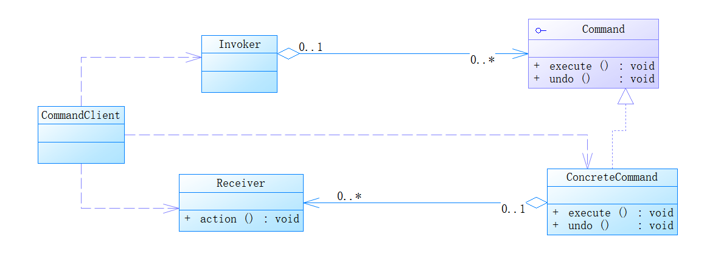
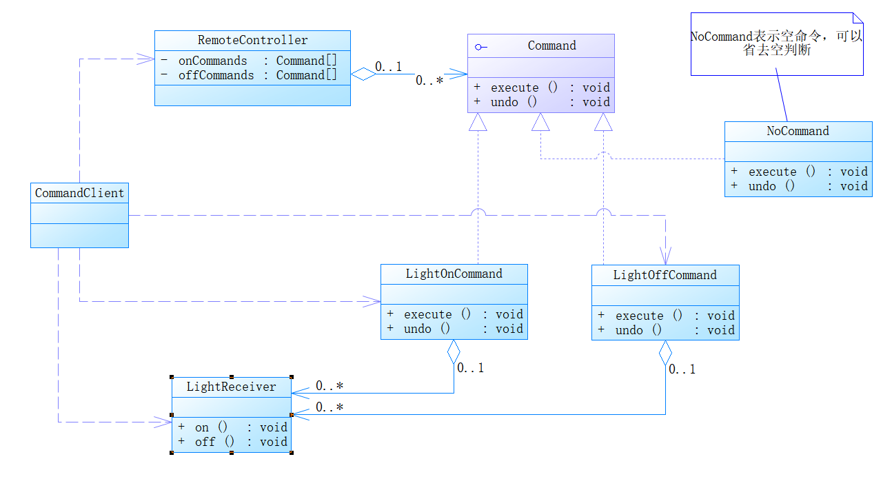

- # 基本介绍

  1) 命令模式（Command Pattern）：在软件设计中，我们经常需要向某些对象发送请求，但是并不知道请求的接收者是谁，也不知

  道被请求的操作是哪个，我们只需在程序运行时指定具体的请求接收者即可，此时，可以使用命令模式来进行设计

  2) 命名模式使得请求发送者与请求接收者消除彼此之间的耦合，让对象之间的调用关系更加灵活，实现解耦。

  3) 在命名模式中，会将一个请求封装为一个对象，以便使用不同参数来表示不同的请求(即命名)，同时命令模式也支持可撤销的操作。

  4) 通俗易懂的理解：将军发布命令，士兵去执行。其中有几个角色：将军（命令发布者）、士兵（命令的具体执行者）、命令(连接将军和士兵)。Invoker是调用者（将军），Receiver是被调用者（士兵），MyCommand是命令，实现了Command接口，持有接收对象

- # 基本原理

  Invoker：调用者角色也是命令发起者。

  Command：是命令角色，需要执行的命令都在这里，可以是一个接口也可以是一个抽象类。

  Receiver：命令接收者角色，知道如果实施和执行一个命令请求相关的操作。

  ConcreteCommand：将命令接收者对象（receiver）和一个命令动作进行绑定，调用接收者的相应操作执行命令。

  

- # 应用案例

  ## 1、需求

  编写程序，使用命令模式 完成前面的智能家电项目。使用开关控制电灯、电视......

  ## 2、UML类图

  

  ## 3、代码实现

  ```java
  //客户端测试
  public class CommandClient {
  
      public static void main(String[] args) {
          //使用命令模式，通过遥控操作电灯
          LightReceiver lightReceiver = new LightReceiver();
  
          //创建电灯开关
          LightOffCommand lightOffCommand = new LightOffCommand(lightReceiver);
          LightOnCommand lightOnCommand = new LightOnCommand(lightReceiver);
  
          //创建遥控器
          RemoteController remoteController = new RemoteController();
          remoteController.setCommand(0,lightOnCommand,lightOffCommand);
          System.out.println("==================打开======================");
          remoteController.onButtonWasPushed(0);
          System.out.println("==================关闭======================");
          remoteController.offButtonWasPushed(0);
          System.out.println("==================撤销======================");
          remoteController.undoButtonWasPushed(0);
      }
  }
  ```

  ```java
  //遥控器
  public class RemoteController {
  
      private Command[] onCommands;
      private Command[] offCommands;
      private Command undoCommand;
  
      /**
       * 构造方法，五组开关
       */
      public RemoteController() {
          onCommands = new Command[5];
          offCommands = new Command[5];
          //构造空命令，避免空判断
          for (int i = 0; i < 5; i++) {
              onCommands[i] = new NoCommand();
              offCommands[i] = new NoCommand();
          }
      }
  
      /**
       * 给按钮设置需要发送的命令
       * @param no
       * @param onCommand
       * @param offCommand
       */
      public void setCommand(int no,Command onCommand,Command offCommand){
          onCommands[no] = onCommand;
          offCommands[no] = offCommand;
      }
  
      /**
       * 按下开按钮
       * @param no
       */
      public void onButtonWasPushed(int no){
          onCommands[no].execute();
          undoCommand = onCommands[no];
      }
  
      /**
       * 按下关按钮
       * @param no
       */
      public void offButtonWasPushed(int no){
          offCommands[no].execute();
          undoCommand = offCommands[no];
      }
  
      /**
       * 按下撤销按钮
       * @param no
       */
      public void undoButtonWasPushed(int no){
          undoCommand.undo();
      }
  }
  ```

  ```java
  public class LightReceiver {
  
      public void on(){
          System.out.println("电灯打开。。。。。。。。。。。。。。。");
      }
  
      public void off(){
          System.out.println("电灯关闭。。。。。。。。。。。。。。。");
      }
  }
  ```

  ```java
  public interface Command {
  
      /**
       * 执行操作
       */
      void execute();
  
      /**
       * 撤销操作
       */
      void undo();
  }
  ```

  ```java
  public class LightOffCommand implements Command {
  
      /**
       * 聚合LightReceiver
       */
      private LightReceiver lightReceiver;
  
      public LightOffCommand(LightReceiver lightReceiver) {
          this.lightReceiver = lightReceiver;
      }
  
      @Override
      public void execute() {
          lightReceiver.off();
      }
  
      @Override
      public void undo() {
          lightReceiver.on();
      }
  }
  ```

  ```java
  public class LightOnCommand implements Command {
      /**
       * 聚合LightReceiver
       */
      private LightReceiver lightReceiver;
  
      public LightOnCommand(LightReceiver lightReceiver) {
          this.lightReceiver = lightReceiver;
      }
  
      @Override
      public void execute() {
          lightReceiver.on();
      }
  
      @Override
      public void undo() {
          lightReceiver.off();
      }
  }
  ```

  ```java
  public class NoCommand implements Command {
      @Override
      public void execute() {
  
      }
  
      @Override
      public void undo() {
  
      }
  }
  ```

  

- # Spring源码分析

  命令模式在spring框架JdbcTemplate应用的源码分析：

  StatementCallback<T>接口:类似命令接口command

  QueryStatementCallback：JdbcTemplate中的内部类实现了命令接口，同时也充当了命令接收者

  JdbcTemplate：命令的调用者，execute方法中action.doInStatement(stmt)方法，不同的实现StatementCallback接口对象，对应了不同的doInStatement逻辑。

  ```java
  public class JdbcTemplate extends JdbcAccessor implements JdbcOperations {
      @Override
  	@Nullable
  	public <T> T query(final String sql, final ResultSetExtractor<T> rse) throws DataAccessException {
  		Assert.notNull(sql, "SQL must not be null");
  		Assert.notNull(rse, "ResultSetExtractor must not be null");
  		if (logger.isDebugEnabled()) {
  			logger.debug("Executing SQL query [" + sql + "]");
  		}
  
  		/**
  		 * Callback to execute the query.
  		 */
  		class QueryStatementCallback implements StatementCallback<T>, SqlProvider {
  			@Override
  			@Nullable
  			public T doInStatement(Statement stmt) throws SQLException {
  				ResultSet rs = null;
  				try {
  					rs = stmt.executeQuery(sql);
  					return rse.extractData(rs);
  				}
  				finally {
  					JdbcUtils.closeResultSet(rs);
  				}
  			}
  			@Override
  			public String getSql() {
  				return sql;
  			}
  		}
  
  		return execute(new QueryStatementCallback());
  	}
      
      @Override
  	@Nullable
  	public <T> T execute(StatementCallback<T> action) throws DataAccessException {
  		Assert.notNull(action, "Callback object must not be null");
  
  		Connection con = DataSourceUtils.getConnection(obtainDataSource());
  		Statement stmt = null;
  		try {
  			stmt = con.createStatement();
  			applyStatementSettings(stmt);
  			T result = action.doInStatement(stmt);
  			handleWarnings(stmt);
  			return result;
  		}
  		catch (SQLException ex) {
  			// Release Connection early, to avoid potential connection pool deadlock
  			// in the case when the exception translator hasn't been initialized yet.
  			String sql = getSql(action);
  			JdbcUtils.closeStatement(stmt);
  			stmt = null;
  			DataSourceUtils.releaseConnection(con, getDataSource());
  			con = null;
  			throw translateException("StatementCallback", sql, ex);
  		}
  		finally {
  			JdbcUtils.closeStatement(stmt);
  			DataSourceUtils.releaseConnection(con, getDataSource());
  		}
  	}
  }
  ```

- # 总结

  1) 将发起请求的对象与执行请求的对象解耦。发起请求的对象是调用者，调用者只要调用命令对象的execute()方法就可以让接收者工作，而不必知道具体的接收者对象是谁、是如何实现的，命令对象会负责让接收者执行请求的动作，也就是说：”请求发起者”和“请求执行者”之间的解耦是通过命令对象实现的，命令对象起到了纽带桥梁的作用。

  2) 容易设计一个命令队列。只要把命令对象放到列队，就可以多线程的执行命令

  3) 容易实现对请求的撤销和重做

  4) 命令模式不足：可能导致某些系统有过多的具体命令类，增加了系统的复杂度，这点在在使用的时候要注意

  5) 空命令也是一种设计模式，它为我们省去了判空的操作。在上面的实例中，如果没有用空命令，我们每按下一个按键都要判空，这给我们编码带来一定的麻烦。

  6) 命令模式经典的应用场景：界面的一个按钮都是一条命令、模拟CMD（DOS命令） 订单的撤销/恢复、触发-反馈机制
